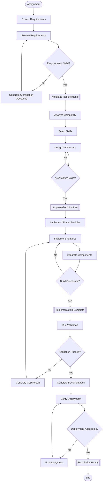
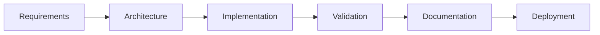

# WORKFLOW.md

Version: 1.0

Purpose: Define the execution flow of the AI Multi-Agent Software Engineering System.

This workflow is deterministic.

Each phase consumes artifacts from the previous phase and produces new artifacts.

No phase may skip validation.

---

# Overall Pipeline

```text
Assignment
      │
      ▼
Requirements Analysis
      │
      ▼
Requirements Review
      │
      ▼
Complexity Analysis
      │
      ▼
Skill Selection
      │
      ▼
Architecture Design
      │
      ▼
Implementation
      │
      ▼
Integration
      │
      ▼
Validation
      │
      ▼
Documentation
      │
      ▼
Deployment Verification
      │
      ▼
Final Submission
```

---

# Workflow Diagram



---

# Phase 1 — Requirement Analysis

## Owner

Requirements & Planning Agent

---

## Inputs

- Assignment
- Supporting Documents

---

## Tasks

- Extract functional requirements
- Extract non-functional requirements
- Extract constraints
- Extract deliverables
- Extract acceptance criteria
- Identify ambiguity
- Identify missing information

---

## Outputs

```text
requirements.json
```

```text
review.md
```

---

## Validation

Must satisfy:

- No duplicated requirements
- No conflicting requirements
- All requirements quoted
- Confidence assigned
- Missing information documented

---

# Phase 2 — Complexity Analysis

## Owner

Requirements & Planning Agent

---

## Inputs

```text
requirements.json
```

---

## Tasks

- Estimate complexity
- Estimate phases
- Estimate team size
- Estimate implementation effort

---

## Outputs

```text
complexity.md
```

---

## Validation

Complexity must align with validated requirements.

No assumptions.

---

# Phase 3 — Skill Selection

## Owner

Requirements & Planning Agent

---

## Inputs

```text
requirements.json
```

---

## Tasks

- Discover reusable skills
- Evaluate existing skills
- Select minimum skill set

---

## Outputs

```text
skills.md
```

---

## Validation

- No unnecessary skills
- No duplicated skills
- Only required skills selected

---

# Phase 4 — Architecture Design

## Owner

Architecture Designer Agent

---

## Inputs

```text
requirements.json
skills.md
```

---

## Tasks

- Design architecture
- Design modules
- Design components
- Design folder structure
- Design data flow
- Design event flow
- Document trade-offs

---

## Outputs

```text
architecture.md
```

```text
components.md
```

```text
modules.md
```

---

## Validation

Every requirement maps to architecture.

No unsupported feature.

---

# Phase 5 — Implementation

## Owner

Implementation Agent

---

## Inputs

```text
architecture.md

components.md

modules.md
```

---

## Tasks

- Build shared modules
- Build UI
- Build validation
- Build synchronization
- Integrate system

---

## Outputs

```text
source code
```

---

## Validation

- Project builds
- No compilation errors
- Responsive UI
- Functional synchronization

---

# Phase 6 — Integration

## Owner

Implementation Agent

---

## Tasks

- Connect modules
- Verify communication
- Resolve integration issues

---

## Outputs

Integrated application

---

## Validation

- Components communicate correctly
- Event flow complete

---

# Phase 7 — Validation

## Owner

Quality & Delivery Agent

---

## Inputs

- Source Code
- Requirements
- Architecture

---

## Tasks

- Requirement coverage
- Acceptance validation
- Responsive validation
- Synchronization validation

---

## Outputs

```text
validation.md
```

```text
coverage.md
```

---

## Validation Rules

Every requirement must have

Implementation

AND

Validation

---

# Phase 8 — Documentation

## Owner

Quality & Delivery Agent

---

## Tasks

Generate

- README verification
- Architecture verification
- Project documentation verification

---

## Outputs

```text
submission.md
```

---

## Validation

All required documentation exists.

---

# Phase 9 — Deployment Verification

## Owner

Quality & Delivery Agent

---

## Tasks

- Verify deployment URL
- Verify application availability
- Verify synchronization

---

## Outputs

Deployment Report

---

## Validation

Deployment must

- Load successfully
- Be publicly accessible
- Match local implementation

---

# Retry Strategy

## Requirement Failure

Return

```text
Requirement Review
```

---

## Architecture Failure

Return

```text
Architecture Design
```

---

## Implementation Failure

Return

```text
Implementation
```

---

## Validation Failure

Generate

```text
Gap Report
```

↓

Return affected module

↓

Revalidate

---

## Deployment Failure

```text
Fix

↓

Redeploy

↓

Revalidate
```

---

# Decision Rules

## Requirements

Never invent requirements.

---

## Architecture

Never add unsupported features.

---

## Implementation

Must follow architecture.

No redesign allowed.

---

## Validation

Never modify implementation.

Only report findings.

---

## Documentation

Reflect implemented behavior only.

---

# Dependency Graph



---

# Artifact Flow

| Artifact          | Producer             | Consumer                                  |
| ----------------- | -------------------- | ----------------------------------------- |
| requirements.json | Requirements Agent   | Architecture Agent                        |
| review.md         | Requirements Agent   | Requirements Agent                        |
| complexity.md     | Requirements Agent   | Architecture Agent                        |
| skills.md         | Requirements Agent   | Architecture Agent / Implementation Agent |
| architecture.md   | Architecture Agent   | Implementation Agent                      |
| components.md     | Architecture Agent   | Implementation Agent                      |
| modules.md        | Architecture Agent   | Implementation Agent                      |
| source code       | Implementation Agent | Quality Agent                             |
| validation.md     | Quality Agent        | Final Reviewer                            |
| coverage.md       | Quality Agent        | Final Reviewer                            |
| submission.md     | Quality Agent        | End User                                  |

---

# Exit Criteria

The workflow is complete only when all conditions are satisfied:

- All validated requirements implemented.
- Architecture approved.
- Build successful.
- Validation passed.
- Documentation complete.
- Deployment verified.
- Deliverables generated.
- No unresolved blocking issues remain.

---

# Workflow Principles

1. Requirements are the single source of truth.
2. Validate before progressing.
3. One owner per artifact.
4. No skipped phases.
5. Minimize assumptions.
6. Prefer reuse over reinvention.
7. Produce deterministic outputs.
8. Keep every phase independently verifiable.
